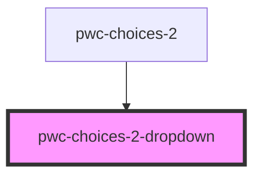

# pwc-choices-2

<!-- Auto Generated Below -->

## Properties

| Property          | Attribute           | Description | Type        | Default     |
| ----------------- | ------------------- | ----------- | ----------- | ----------- |
| `noOptionsString` | `no-options-string` |             | `string`    | `undefined` |
| `options`         | --                  |             | `IOption[]` | `undefined` |

## Events

| Event                   | Description | Type                                              |
| ----------------------- | ----------- | ------------------------------------------------- |
| `dropdownOptionClicked` |             | `CustomEvent<IDropdownOptionClickedEventPayload>` |

## Dependencies

### Used by

 - [pwc-choices-2](../pwc-choices-2)

### Graph

----------------------------------------------

*Built with [StencilJS](https://stenciljs.com/)*
