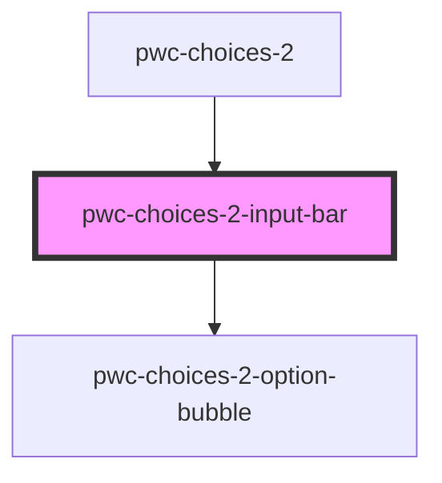

# pwc-choices-2

<!-- Auto Generated Below -->

## Properties

| Property              | Attribute               | Description | Type        | Default     |
| --------------------- | ----------------------- | ----------- | ----------- | ----------- |
| `autoHidePlaceholder` | `auto-hide-placeholder` |             | `boolean`   | `undefined` |
| `options`             | --                      |             | `IOption[]` | `undefined` |
| `placeholder`         | `placeholder`           |             | `string`    | `undefined` |
| `showCloseButtons`    | `show-close-buttons`    |             | `boolean`   | `undefined` |

## Events

| Event             | Description | Type                                        |
| ----------------- | ----------- | ------------------------------------------- |
| `inputBarClicked` |             | `CustomEvent<IInputBarClickedEventPayload>` |
| `optionDiscarded` |             | `CustomEvent<IOptionDiscardedEventPayload>` |

## Dependencies

### Used by

 - [pwc-choices-2](../pwc-choices-2)

### Depends on

- [pwc-choices-2-option-bubble](../pwc-choices-2-option-bubble)

### Graph

----------------------------------------------

*Built with [StencilJS](https://stenciljs.com/)*
