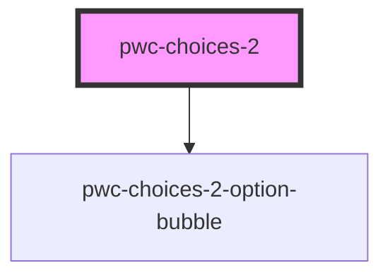

# pwc-choices-2

<!-- Auto Generated Below -->

## Properties

| Property              | Attribute               | Description                                                                 | Type                  | Default     |
| --------------------- | ----------------------- | --------------------------------------------------------------------------- | --------------------- | ----------- |
| `autoHidePlaceholder` | `auto-hide-placeholder` | If true, the placeholder will be hidden if there are selected options.      | `boolean`             | `true`      |
| `dropdownIsOpen`      | `dropdown-is-open`      |                                                                             | `boolean`             | `false`     |
| `options`             | `options`               |                                                                             | `IOption[] \| string` | `undefined` |
| `placeholder`         | `placeholder`           |                                                                             | `string`              | `undefined` |
| `showCloseButtons`    | `show-close-buttons`    | If true, selected option bubbles will have close buttons.                   | `boolean`             | `true`      |
| `type`                | `type`                  |                                                                             | `"multi" \| "single"` | `"multi"`   |
| `uniqueSelections`    | `unique-selections`     | If true, the option will be removed from available options after selection. | `boolean`             | `true`      |

## Methods

### `getSelectedOptions() => Promise<PwcChoices2.IOption[]>`

#### Returns

Type: `Promise<IOption[]>`

## Dependencies

### Depends on

- [pwc-choices-2-option-bubble](../pwc-choices-2-option-bubble)

### Graph

----------------------------------------------

*Built with [StencilJS](https://stenciljs.com/)*
