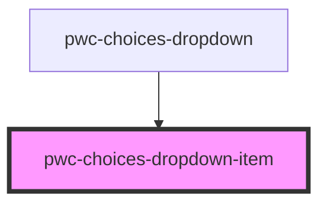

# pwc-choices

<!-- Auto Generated Below -->

## Properties

| Property             | Attribute             | Description | Type                                   | Default     |
| -------------------- | --------------------- | ----------- | -------------------------------------- | ----------- |
| `active`             | `active`              |             | `boolean`                              | `undefined` |
| `isNoOption`         | `is-no-option`        |             | `boolean`                              | `undefined` |
| `option`             | --                    |             | `FilterResult<IOption>`                | `undefined` |
| `selectCount`        | `select-count`        |             | `number`                               | `undefined` |
| `selectionBehaviour` | `selection-behaviour` |             | `"accumulate" \| "remove" \| "toggle"` | `undefined` |

## Events

| Event                 | Description | Type                                            |
| --------------------- | ----------- | ----------------------------------------------- |
| `dropdownItemClicked` |             | `CustomEvent<IDropdownItemClickedEventPayload>` |

## Dependencies

### Used by

 - [pwc-choices-dropdown](../pwc-choices-dropdown)

### Graph

----------------------------------------------

*Built with [StencilJS](https://stenciljs.com/)*
