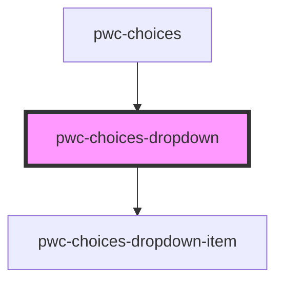

# pwc-choices

<!-- Auto Generated Below -->

## Properties

| Property               | Attribute                | Description | Type        | Default     |
| ---------------------- | ------------------------ | ----------- | ----------- | ----------- |
| `noOptionsString`      | `no-options-string`      |             | `string`    | `undefined` |
| `options`              | --                       |             | `IOption[]` | `undefined` |
| `searchBarPlaceholder` | `search-bar-placeholder` |             | `string`    | `undefined` |

## Dependencies

### Used by

 - [pwc-choices](../pwc-choices)

### Depends on

- [pwc-choices-dropdown-item](../pwc-choices-dropdown-item)

### Graph

----------------------------------------------

*Built with [StencilJS](https://stenciljs.com/)*
