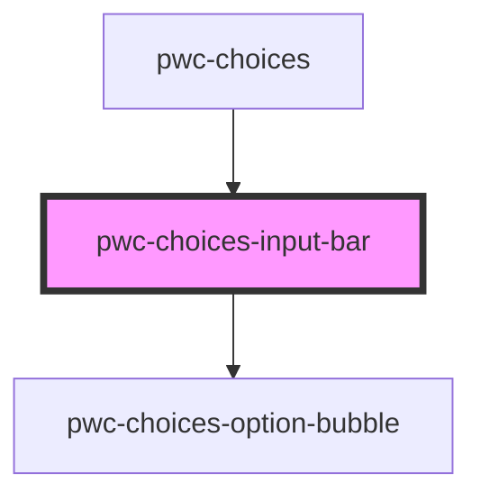

# pwc-choices

<!-- Auto Generated Below -->

## Properties

| Property              | Attribute               | Description | Type                                        | Default     |
| --------------------- | ----------------------- | ----------- | ------------------------------------------- | ----------- |
| `autoHidePlaceholder` | `auto-hide-placeholder` |             | `boolean`                                   | `undefined` |
| `displayMode`         | `display-mode`          |             | `"bubblesOnly" \| "countOnly" \| "dynamic"` | `undefined` |
| `options`             | --                      |             | `IOption[]`                                 | `undefined` |
| `placeholder`         | `placeholder`           |             | `string`                                    | `undefined` |
| `showCloseButtons`    | `show-close-buttons`    |             | `boolean`                                   | `undefined` |
| `type`                | `type`                  |             | `"multi" \| "single"`                       | `"multi"`   |

## Events

| Event             | Description | Type                                        |
| ----------------- | ----------- | ------------------------------------------- |
| `inputBarClicked` |             | `CustomEvent<IInputBarClickedEventPayload>` |
| `optionDiscarded` |             | `CustomEvent<IOptionDiscardedEventPayload>` |

## Dependencies

### Used by

 - [pwc-choices](../pwc-choices)

### Depends on

- [pwc-choices-option-bubble](../pwc-choices-option-bubble)

### Graph

----------------------------------------------

*Built with [StencilJS](https://stenciljs.com/)*
