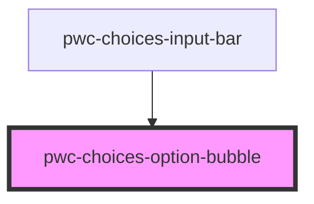

# pwc-choices-option-bubble

<!-- Auto Generated Below -->

## Properties

| Property              | Attribute                | Description | Type      | Default     |
| --------------------- | ------------------------ | ----------- | --------- | ----------- |
| `displayIcon`         | `display-icon`           |             | `boolean` | `undefined` |
| `indexInSelectedList` | `index-in-selected-list` |             | `number`  | `undefined` |
| `option`              | --                       |             | `IOption` | `undefined` |
| `showCloseButton`     | `show-close-button`      |             | `boolean` | `undefined` |

## Events

| Event          | Description | Type                                                 |
| -------------- | ----------- | ---------------------------------------------------- |
| `closeClicked` |             | `CustomEvent<IOptionBubbleCloseClickedEventPayload>` |

## Dependencies

### Used by

 - [pwc-choices-input-bar](../pwc-choices-input-bar)

### Graph

----------------------------------------------

*Built with [StencilJS](https://stenciljs.com/)*
