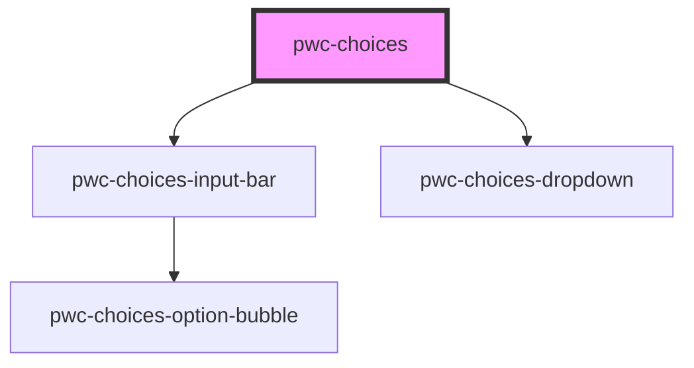

# pwc-choices

<!-- Auto Generated Below -->

## Properties

| Property              | Attribute               | Description                                                                                                                                                          | Type                                             | Default                        |
| --------------------- | ----------------------- | -------------------------------------------------------------------------------------------------------------------------------------------------------------------- | ------------------------------------------------ | ------------------------------ |
| `autoHidePlaceholder` | `auto-hide-placeholder` | If true, the placeholder will be hidden if there are selected options.                                                                                               | `boolean`                                        | `true`                         |
| `distinctMode`        | `distinct-mode`         | This is the mode of filtering we use to make given option objects distinct.                                                                                          | `"all" \| "any" \| "label" \| "none" \| "value"` | `"none"`                       |
| `dropdownIsOpen`      | `dropdown-is-open`      | This determines wheter the dropdown is open or not.                                                                                                                  | `boolean`                                        | `false`                        |
| `name`                | `name`                  | HTML name attribute. This is implemented for compatibility with HTML forms, it has no internal usage.                                                                | `string`                                         | `undefined`                    |
| `noOptionsString`     | `no-options-string`     | This will be displayed in the dropdown when there are no options left to choose.                                                                                     | `string`                                         | `"No options to choose from."` |
| `options`             | `options`               | The options available to this component. An option must have a label and a value property.                                                                           | `IOption[] \| string`                            | `undefined`                    |
| `placeholder`         | `placeholder`           | This will be displayed in the input bar before any selected options.                                                                                                 | `string`                                         | `undefined`                    |
| `showCloseButtons`    | `show-close-buttons`    | If true, selected option bubbles will have close buttons.                                                                                                            | `boolean`                                        | `true`                         |
| `type`                | `type`                  | The selection behaviour. "multi" allows selection of multiple options. "single" allows selection of only a single option (just like the native HTML select element). | `"multi" \| "single"`                            | `"multi"`                      |
| `uniqueSelections`    | `unique-selections`     | If true, the option will be removed from available options after selection.                                                                                          | `boolean`                                        | `true`                         |

## Events

| Event                    | Description                                      | Type                     |
| ------------------------ | ------------------------------------------------ | ------------------------ |
| `selectedOptionsChanged` | This is raised when the selected options change. | `CustomEvent<IOption[]>` |

## Methods

### `getSelectedOptionsAsLabels() => Promise<string[]>`

Returns the labels of currently selected options.

#### Returns

Type: `Promise<string[]>`

### `getSelectedOptionsAsObjects() => Promise<IOption[]>`

Returns the selected options as objects (as passed in to this component).

#### Returns

Type: `Promise<IOption[]>`

### `getSelectedOptionsAsValues() => Promise<string[]>`

Returns the values of currently selected options.

#### Returns

Type: `Promise<string[]>`

## Dependencies

### Depends on

- [pwc-choices-input-bar](../pwc-choices-input-bar)
- [pwc-choices-dropdown](../pwc-choices-dropdown)

### Graph

----------------------------------------------

*Built with [StencilJS](https://stenciljs.com/)*
