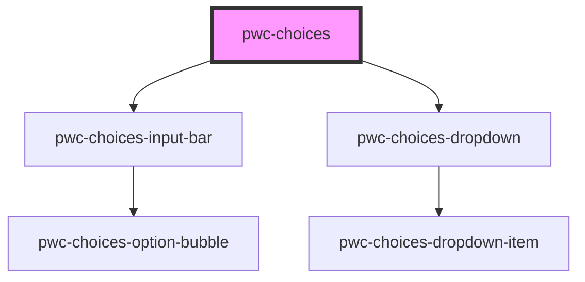

# pwc-choices

<!-- Auto Generated Below -->

## Properties

| Property                     | Attribute                      | Description                                                                                                                                                                                                                                                                                                                                                                                                                                                                                                                               | Type                                                                                                                                               | Default                        |
| ---------------------------- | ------------------------------ | ----------------------------------------------------------------------------------------------------------------------------------------------------------------------------------------------------------------------------------------------------------------------------------------------------------------------------------------------------------------------------------------------------------------------------------------------------------------------------------------------------------------------------------------- | -------------------------------------------------------------------------------------------------------------------------------------------------- | ------------------------------ |
| `autoHidePlaceholder`        | `auto-hide-placeholder`        | If true, the placeholder will be hidden if there are selected options.                                                                                                                                                                                                                                                                                                                                                                                                                                                                    | `boolean`                                                                                                                                          | `true`                         |
| `countTextProvider`          | --                             | Use this function to provide the text for the count display. It is invoked with the current selected option count.                                                                                                                                                                                                                                                                                                                                                                                                                        | `(count: number) => string`                                                                                                                        | `undefined`                    |
| `displayIconsOnInputBar`     | `display-icons-on-input-bar`   | If true, option icons will be displayed on the input bar as well.                                                                                                                                                                                                                                                                                                                                                                                                                                                                         | `boolean`                                                                                                                                          | `undefined`                    |
| `distinctMode`               | `distinct-mode`                | This is the mode of filtering we use to make given option objects distinct. "none" disables the distinct filtering behaviour.                                                                                                                                                                                                                                                                                                                                                                                                             | `"all" \| "any" \| "label" \| "none" \| "value"`                                                                                                   | `"none"`                       |
| `dropdownIsOpen`             | `dropdown-is-open`             | This determines wheter the dropdown is open or not.                                                                                                                                                                                                                                                                                                                                                                                                                                                                                       | `boolean`                                                                                                                                          | `false`                        |
| `dropdownSelectionBehaviour` | `dropdown-selection-behaviour` | This determines what happens to dropdown items after they are selected.  * `remove`: remove the selected item from the dropdown. * `toggle`: dropdown items become toggles, that is, they remain in the dropdown and remove themself from the input bar when clicked again. * `accumulate`: a click on a dropdown item is always a select command, and the item always stays in the dropdown.  Both `remove` and `toggle` ensures the uniqueness of the selections, while `accumulate` allows for multiple selections of the same option. | `"accumulate" \| "remove" \| "toggle"`                                                                                                             | `"remove"`                     |
| `dropdownToggleText`         | `dropdown-toggle-text`         | This is the text in the indicator of the options when they are in toggle mode.                                                                                                                                                                                                                                                                                                                                                                                                                                                            | `string`                                                                                                                                           | `"\u2713"`                     |
| `inputBarDisplayMode`        | `input-bar-display-mode`       | (multi select mode only) Maximum number of option bubbles to display in the input bar.  * `countOnly`: display only the selected option count. * `dynamic`: display the option bubbles if they fit. when they overflow, switch to selected option count. * `bubblesOnly`: display only the option bubbles.                                                                                                                                                                                                                                | `"bubblesOnly" \| "countOnly" \| "dynamic"`                                                                                                        | ``bubblesOnly``                |
| `name`                       | `name`                         | HTML name attribute. This is implemented for compatibility with HTML forms, it has no internal usage.                                                                                                                                                                                                                                                                                                                                                                                                                                     | `string`                                                                                                                                           | `undefined`                    |
| `noOptionsString`            | `no-options-string`            | This will be displayed in the dropdown when there are no options left to choose.                                                                                                                                                                                                                                                                                                                                                                                                                                                          | `string`                                                                                                                                           | `"No options to choose from."` |
| `options`                    | `options`                      | The options available to this component. An option must have a label and a value property.                                                                                                                                                                                                                                                                                                                                                                                                                                                | `IOption[] \| string`                                                                                                                              | `undefined`                    |
| `placeholder`                | `placeholder`                  | This will be displayed in the input bar after the selected options.                                                                                                                                                                                                                                                                                                                                                                                                                                                                       | `string`                                                                                                                                           | `undefined`                    |
| `popperjsOptionsForDropdown` | --                             | The options to pass to the prop.js constructor, which handles the dropdown placement.                                                                                                                                                                                                                                                                                                                                                                                                                                                     | `{ placement?: Placement; modifiers?: Partial<Modifier<any>>[]; strategy?: PositioningStrategy; onFirstUpdate?: (arg0: Partial<State>) => void; }` | `undefined`                    |
| `searchBarPlaceholder`       | `search-bar-placeholder`       | This will appear in the search bar when there is no input.                                                                                                                                                                                                                                                                                                                                                                                                                                                                                | `string`                                                                                                                                           | `undefined`                    |
| `showCloseButtons`           | `show-close-buttons`           | If true, selected option bubbles will have close buttons.                                                                                                                                                                                                                                                                                                                                                                                                                                                                                 | `boolean`                                                                                                                                          | `true`                         |
| `type`                       | `type`                         | The selection behaviour. "multi" allows selection of multiple options. "single" allows selection of only a single option (just like the native HTML select element).                                                                                                                                                                                                                                                                                                                                                                      | `"multi" \| "single"`                                                                                                                              | `"multi"`                      |

## Events

| Event                    | Description                                      | Type                     |
| ------------------------ | ------------------------------------------------ | ------------------------ |
| `selectedOptionsChanged` | This is raised when the selected options change. | `CustomEvent<IOption[]>` |

## Methods

### `getSelectedOptionsAsLabels() => Promise<string[]>`

Returns the labels of currently selected options.

#### Returns

Type: `Promise<string[]>`

### `getSelectedOptionsAsObjects() => Promise<IOption[]>`

Returns the selected options as objects (as passed in to this component).

#### Returns

Type: `Promise<IOption[]>`

### `getSelectedOptionsAsValues() => Promise<string[]>`

Returns the values of currently selected options.

#### Returns

Type: `Promise<string[]>`

## Dependencies

### Depends on

- [pwc-choices-input-bar](../pwc-choices-input-bar)
- [pwc-choices-dropdown](../pwc-choices-dropdown)

### Graph

----------------------------------------------

*Built with [StencilJS](https://stenciljs.com/)*
